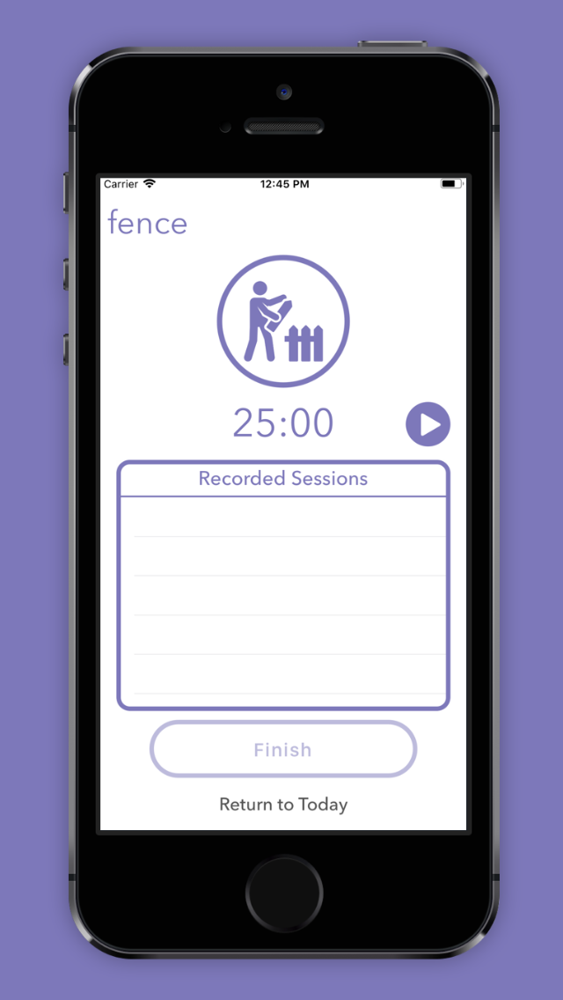

# Mastery

Mastery is a goal tracking app. The application allows the user to create goals and tasks for those goals. When the user wishes to commit time to intentional focus on a task, they choose an amount of time to focus on the task, then begin a session of directed focus.

We needed the icons of each task to represent the goal they belonged to (consistent color scheme) and have their design easily reflect to the user the completion of the task as well as the purpose of the task itself. This lead us to a task icon and 
"task ring" design.

My reponsibilities in the project included completion of the "Today's Tasks" and focus side of the app, as well as designing the icon Xibs and animations.

In the below image there is a task "fence" where the user has chosen a 25 minute focus time:

In the below image the user has completed their task "weightlifting" and has moved on to their mandatory 5 minute break. if the user sends the app to the background or locks their phone, the app will send a notification when the break is over, if they wish to complete a subsequent session.

